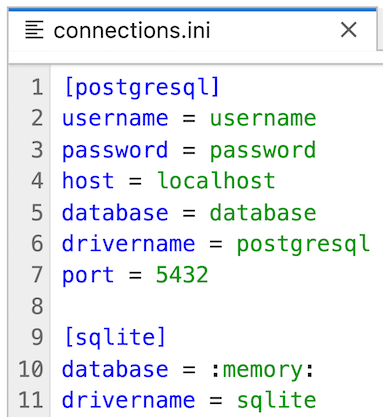
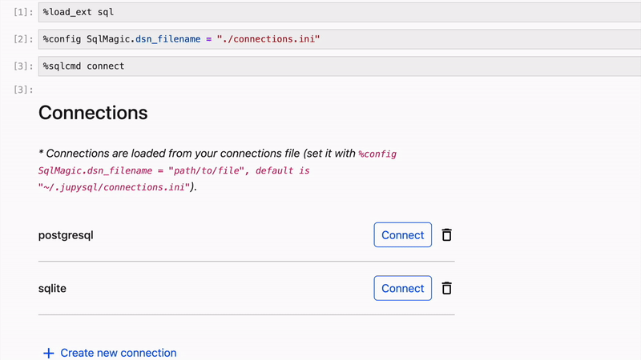
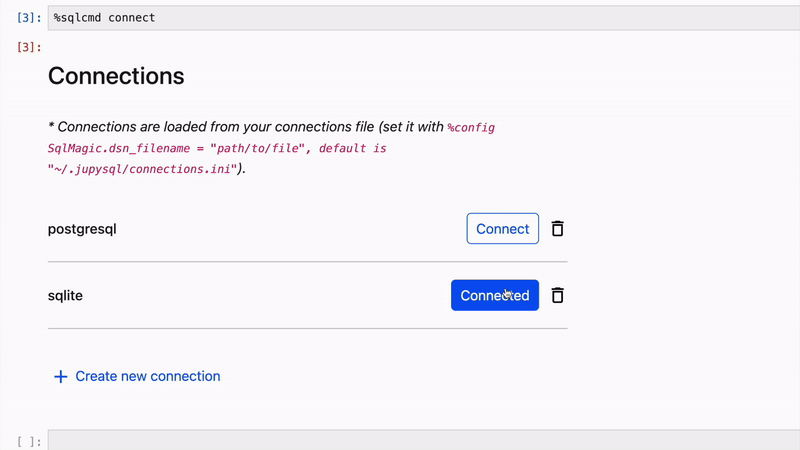
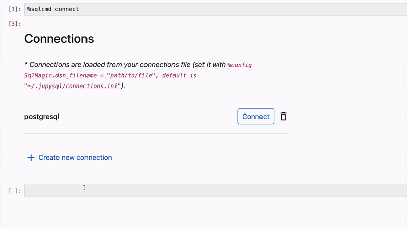

---
jupytext:
  notebook_metadata_filter: myst
  text_representation:
    extension: .md
    format_name: myst
    format_version: 0.13
    jupytext_version: 1.15.0
kernelspec:
  display_name: Python 3 (ipykernel)
  language: python
  name: python3
myst:
  html_meta:
    description lang=en: Documentation for the %sqlcmd tables and %sqlcmd columns
      from JupySQL
    keywords: jupyter, sql, jupysql, tables, columns
    property=og:locale: en_US
---

# `%sqlcmd connect`

`%sqlcmd connect` displays a widget that shows existing connections and allows users to create new connections.

## Installation
Since `%sqlcmd connect` uses an optional `jupysql_plugin` package, please ensure that you have installed the latest version of the JupySQL plugin by running the following command: 

```sh
pip install jupysql-plugin --upgrade
```

+++

## Store connections in `connections.ini`

For every connection, the alias should be enclosed within brackets [], followed by the corresponding connection details. When connecting using sqlite or duckdb, `database` and `drivername` need to be specified. For postgresql, mysql, mariadb, and snowflake connections, the `username`, `password`, `host`, `database`, `drivername`, and `port` are required.



+++

## `%sqlcmd connect`

Displays existing connections. 

### Connect to a connection
Using the provided widget, you can easily connect to a different connection by clicking the Connect button on the right.



### Delete a connection

You can delete an existing connection by clicking the trash bin icon located on the right.



### Create a new connection

You can create a new connection by clicking the 'Create new connection' and filling up the required information.



```{code-cell} ipython3

```
