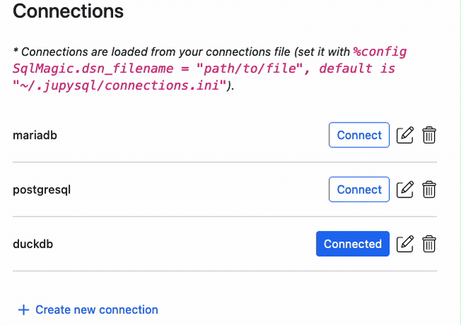

---
jupytext:
  notebook_metadata_filter: myst
  text_representation:
    extension: .md
    format_name: myst
    format_version: 0.13
    jupytext_version: 1.15.0
kernelspec:
  display_name: Python 3 (ipykernel)
  language: python
  name: python3
myst:
  html_meta:
    description lang=en: Documentation for the %sqlcmd tables and %sqlcmd columns
      from JupySQL
    keywords: jupyter, sql, jupysql, tables, columns
    property=og:locale: en_US
---

# `%sqlcmd connect`

```{versionadded} 0.10.1
```

`%sqlcmd connect` displays a widget that allows you to create new connections and manage existing ones.

## Installation

Since `%sqlcmd connect` uses the optional `jupysql-plugin` package, please install it before continuing:

```sh
pip install jupysql-plugin --upgrade
```

## Create a new connection

Click on the `+ Create new connection` button and fill out the form:


## Delete a connection

Click on trash bin icon and confirm:




## Edit an existing connection

Click on the pencil button, edit details, and click on `Update`:


## Connect to an existing connection

Click on the `Connect` button:


## The connections file

All your connections are stored in the `%config SqlMagic.dsn_filename` file
(`~/.jupysql/connections.ini` by default). You can change the file location
and edit it manually, to learn more, see: [](../user-guide/connection-file.md)