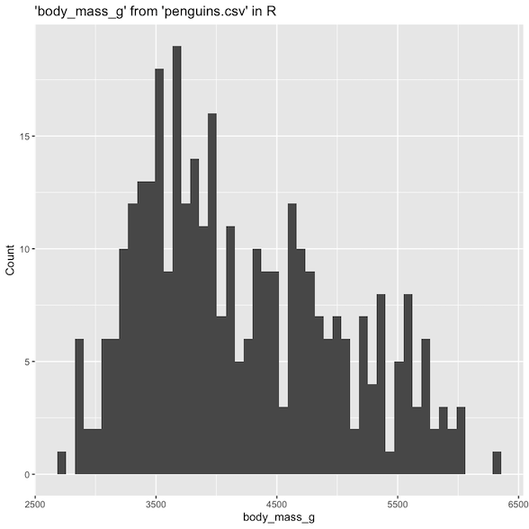

---
jupytext:
  notebook_metadata_filter: myst
  text_representation:
    extension: .md
    format_name: myst
    format_version: 0.13
    jupytext_version: 1.14.7
kernelspec:
  display_name: Python 3 (ipykernel)
  language: python
  name: python3
myst:
  html_meta:
    description lang=en: Documentation for the %sqlplot magic from JupySQL
    keywords: jupyter, sql, jupysql, plotting
    property=og:locale: en_US
---

# `%sqlplot`

```{versionadded} 0.5.2
```


```{note}
`%sqlplot` requires `matplotlib`: `pip install matplotlib` and this example requires
duckdb-engine: `pip install duckdb-engine`
```

```{code-cell} ipython3
%load_ext sql
```

```{code-cell} ipython3
%sql duckdb://
```

```{code-cell} ipython3
from pathlib import Path
from urllib.request import urlretrieve

if not Path("penguins.csv").is_file():
    urlretrieve(
        "https://raw.githubusercontent.com/mwaskom/seaborn-data/master/penguins.csv",
        "penguins.csv",
    )
```

```{code-cell} ipython3
%%sql
SELECT * FROM "penguins.csv" LIMIT 3
```

```{note}
You can view the documentation and command line arguments by running `%sqlplot?`
```

## `%sqlplot boxplot`


```{note}
To use `%sqlplot boxplot`, your SQL engine must support:

`percentile_disc(...) WITHIN GROUP (ORDER BY ...)`

[Snowflake](https://docs.snowflake.com/en/sql-reference/functions/percentile_disc.html),
[Postgres](https://www.postgresql.org/docs/9.4/functions-aggregate.html),
[DuckDB](https://duckdb.org/docs/sql/aggregates), and others support this.
```

Shortcut: `%sqlplot box`

`-t`/`--table` Table to use (if using DuckDB: path to the file to query)

`-c`/`--column` Column(s) to plot. You might pass one than one value (e.g., `-c a b c`)

`-o`/`--orient` Boxplot orientation (`h` for horizontal, `v` for vertical)

`-w`/`--with` Use a previously saved query as input data

```{code-cell} ipython3
%sqlplot boxplot --table penguins.csv --column body_mass_g
```

### Transform data before plotting

```{code-cell} ipython3
%%sql
SELECT island, COUNT(*)
FROM penguins.csv
GROUP BY island
ORDER BY COUNT(*) DESC
```

```{code-cell} ipython3
%%sql --save biscoe --no-execute
SELECT *
FROM penguins.csv
WHERE island = 'Biscoe'
```

```{code-cell} ipython3
%sqlplot boxplot --table biscoe --column body_mass_g --with biscoe
```

### Horizontal boxplot

```{code-cell} ipython3
%sqlplot boxplot --table penguins.csv --column bill_length_mm --orient h
```

### Multiple columns

```{code-cell} ipython3
%sqlplot boxplot --table penguins.csv --column bill_length_mm bill_depth_mm flipper_length_mm
```

## `%sqlplot histogram`

Shortcut: `%sqlplot hist`

`-t`/`--table` Table to use (if using DuckDB: path to the file to query)

`-c`/`--column` Column to plot

`-b`/`--bins` (default: `50`) Number of bins

`-w`/`--with` Use a previously saved query as input data

+++

Histogram supports NULL values by skipping them. Now we can
generate histograms without explicitly removing NULL entries.
```{versionadded} 0.7.9
```

```{code-cell} ipython3
%sqlplot histogram --table penguins.csv --column body_mass_g 
```

When plotting a histogram, it divides a range with the number of bins - 1 to calculate a bin size. Then, it applies round half down relative to the bin size and categorizes continuous values into bins to replicate right closed intervals from the ggplot histogram in R.



+++

### Number of bins

```{code-cell} ipython3
%sqlplot histogram --table penguins.csv --column body_mass_g  --bins 100
```

### Multiple columns

```{code-cell} ipython3
%sqlplot histogram --table penguins.csv --column bill_length_mm bill_depth_mm 
```

## Customize plot

`%sqlplot` returns a `matplotlib.Axes` object.

```{code-cell} ipython3
ax = %sqlplot histogram --table penguins.csv --column body_mass_g
ax.set_title("Body mass (grams)")
_ = ax.grid()
```

## `%sqlplot bar`

```{versionadded} 0.7.6
```

Shortcut: `%sqlplot bar`

`-t`/`--table` Table to use (if using DuckDB: path to the file to query)

`-c`/`--column` Column to plot.

`-o`/`--orient` Barplot orientation (`h` for horizontal, `v` for vertical)

`-w`/`--with` Use a previously saved query as input data

`-S`/`--show-numbers` Show numbers on top of the bar

Bar plot does not support NULL values, so we automatically remove them, when plotting.

```{code-cell} ipython3
%sqlplot bar --table penguins.csv --column species 
```

You can additionally pass two columns to bar plot i.e. `x` and `height` columns.

```{code-cell} ipython3
%%sql --save add_col --no-execute
SELECT species, count(species) as cnt
FROM penguins.csv
group by species
```

```{code-cell} ipython3
%sqlplot bar --table add_col --column species cnt --with add_col
```

You can also pass the orientation using the `orient` argument.

```{code-cell} ipython3
%sqlplot bar --table add_col --column species cnt --with add_col --orient h
```

You can also show the number on top of the bar using the `S`/`show-numbers` argument.

```{code-cell} ipython3
%sqlplot bar --table penguins.csv --column species -S
```

## `%sqlplot pie`

```{versionadded} 0.7.6
```

Shortcut: `%sqlplot pie`

`-t`/`--table` Table to use (if using DuckDB: path to the file to query)

`-c`/`--column` Column to plot

`-w`/`--with` Use a previously saved query as input data

`-S`/`--show-numbers` Show the percentage on top of the pie

Pie chart does not support NULL values, so we automatically remove them, when plotting the pie chart.

```{code-cell} ipython3
%sqlplot pie --table penguins.csv --column species
```

You can additionally pass two columns to bar plot i.e. `labels` and `x` columns.

```{code-cell} ipython3
%%sql --save add_col --no-execute
SELECT species, count(species) as cnt
FROM penguins.csv
group by species
```

```{code-cell} ipython3
%sqlplot pie --table add_col --column species cnt --with add_col
```

Here, `species` is the `labels` column and `cnt` is the `x` column.


You can also show the percentage on top of the pie using the `S`/`show-numbers` argument.

```{code-cell} ipython3
%sqlplot pie --table penguins.csv --column species -S
```
