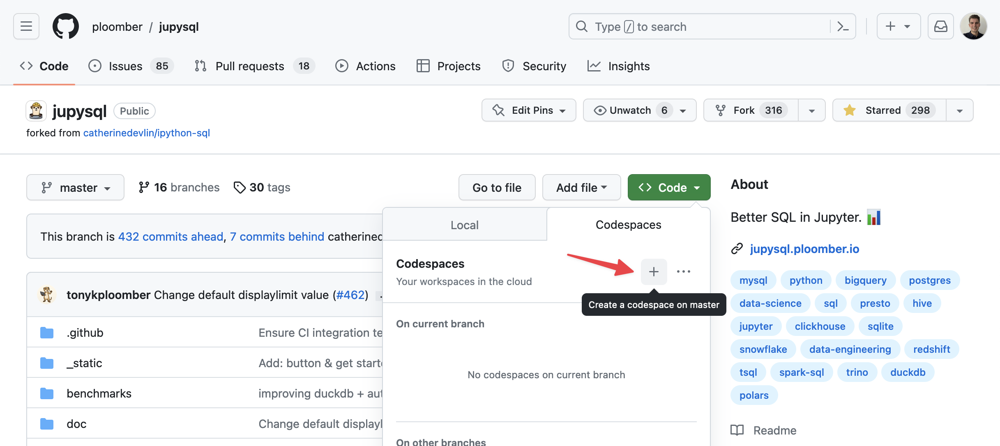
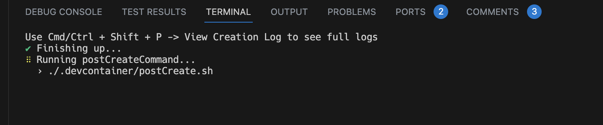

---
jupytext:
  notebook_metadata_filter: myst
  text_representation:
    extension: .md
    format_name: myst
    format_version: 0.13
    jupytext_version: 1.14.5
kernelspec:
  display_name: Python 3 (ipykernel)
  language: python
  name: python3
myst:
  html_meta:
    description lang=en: JupySQL's developer guide
    keywords: jupyter, sql, jupysql
    property=og:locale: en_US
---

# Developer guide

Before continuing, ensure you have a [working development environment locally](https://ploomber-contributing.readthedocs.io/en/latest/contributing/setup.html) or on [github codespaces](https://github.com/features/codespaces).

## Github Codespace

Github Codespaces allow you to spin up a fully configured dev environment in the cloud in a few minutes. Github provides 60 hours a month of free usage (for a 2-core codespace). While codespaces will automatically pauze after 30 min of idle time, it's a good idea to shut your codespace down entirely via [the management dashboard](https://github.com/codespaces) and to [setup spending limits](https://github.com/settings/billing/spending_limit) to avoid unexpected charges.


You can launch a new github codespace from the green "Code" button on [the JupySQL github repository](https://github.com/ploomber/jupysql). 

Note that setup will take a few minutes to finish after the codespace becomes available (wait for the **postCreateCommand** step to finish).


After the codespace has finished setting up, you can run `conda activate jupysql` to activate the JupySQL Conda environment.

+++

## The basics

JupySQL is a Python library that allows users to run SQL queries (among other things) in IPython and Jupyter via a `%sql`/`%%sql` [magic](https://ipython.readthedocs.io/en/stable/interactive/magics.html):

```{code-cell} ipython3
%load_ext sql
```

```{code-cell} ipython3
%sql duckdb://
```

```{code-cell} ipython3
%sql SELECT 42
```

However, there is also a Python API. For example, users can create plots using the `ggplot` module:

```{code-cell} ipython3
from sql.ggplot import ggplot  # noqa
```

So depending on which API is called, the behavior differs. Most notably, when using `%sql`/`%%sql` and other magics, Python tracebacks are hidden, since they're not relevant to the user. For example, if a user tries to query a non-existent table, we won't show the Python traceback:

```{code-cell} ipython3
:tags: [raises-exception]

%sql SELECT * FROM not_a_table
```

On the other hand, if they're using the Python API, we'll show a full traceback.

+++

## Displaying messages

```{important}
Use the `sql.display` module instead of `print` for showing feedback to the user.
```

You can use `message` (contextual information) and `message_success` (successful operations) to show feedback to the user. Here's an example:

```{code-cell} ipython3
from sql.display import message, message_success
```

```{code-cell} ipython3
message("Some information")
```

```{code-cell} ipython3
message_success("Some operation finished successfully!")
```

## Throwing errors

When writing Python libraries, we often throw errors (and display error tracebacks) to let users know that something went wrong. However, JupySQL is an abstraction for executing SQL queries; hence, Python tracebacks a useless to end-users since they expose JupySQL's internals.

So in most circumstances, we only display an error without a traceback. For example, when calling `%sqlplot` without arguments, we get an error:

```{code-cell} ipython3
:tags: [raises-exception]

%sqlplot
```

To implement such behavior, you can use any of the functions defined in `sql.exceptions`, or implement your own. For example, we have a `UsageError` that can be raised when users pass incorrect arguments:

```{code-cell} ipython3
:tags: [raises-exception]

from sql import exceptions

raise exceptions.UsageError("something bad happened")
```

There are other exceptions available, if nothing fits in your scenario, you can add new ones.

```{code-cell} ipython3
:tags: [raises-exception]

raise exceptions.ValueError("something bad happened")
```

```{important}
These errors that hide the traceback should only be used in the `%sql`/`%%sql` magic context. For example, in our ggplot API (Python-based), we do not hide tracebacks as users might need them to debug their code
```

+++

## Getting connections

When adding features to JupySQL magics (`%sql/%%sql`), you can use the `ConnectionManager` to get the current open connections.

```{code-cell} ipython3
:tags: [remove-output]

%load_ext sql
```

```{code-cell} ipython3
import sqlite3

conn = sqlite3.connect("")

%sql sqlite:// --alias sqlite-sqlalchemy
%sql conn --alias sqlite-dbapi
```

We can access the current connection using `ConnectionManager.current`:

```{code-cell} ipython3
from sql.connection import ConnectionManager

conn = ConnectionManager.current
conn
```

To get all open connections:

```{code-cell} ipython3
ConnectionManager.connections
```

## Using connections

Connections are either `SQLAlchemyConnection` or `DBAPIConnection` object. Both have the same interface, the difference is that the first one is a connection established via SQLAlchemy and `DBAPIConnection` one is a connection established by an object that follows the [Python DB API](https://peps.python.org/pep-0249/).

```{code-cell} ipython3
conn_sqlalchemy = ConnectionManager.connections["sqlite-sqlalchemy"]
conn_dbapi = ConnectionManager.connections["sqlite-dbapi"]
```

### `raw_execute`

```{important}
Always use `raw_execute` for user-submitted queries!
```

`raw_execute` allows you to execute a given SQL query in the connection. Unlike `execute`, `raw_execute` does not perform any [transpilation](#sql-transpilation).

```{code-cell} ipython3
conn_sqlalchemy.raw_execute("CREATE TABLE foo (bar INT);")
conn_sqlalchemy.raw_execute("INSERT INTO foo VALUES (42), (43), (44), (45);")
results = conn_sqlalchemy.raw_execute("SELECT * FROM foo")
print("one: ", results.fetchone())
print("many: ", results.fetchmany(size=1))
print("all: ", results.fetchall())
```

```{code-cell} ipython3
conn_dbapi.raw_execute("CREATE TABLE foo (bar INT);")
conn_dbapi.raw_execute("INSERT INTO foo VALUES (42), (43), (44), (45);")
results = conn_dbapi.raw_execute("SELECT * FROM foo")
print("one: ", results.fetchone())
print("many: ", results.fetchmany(size=1))
print("all: ", results.fetchall())
```

### `execute`

```{important}
Only use `execute` for internal queries! (queries defined in our own codebase, not
queries we receive as strings from the user.)
```

`execute` allows you to run a query but it transpiles it so it's compatible with the target database.

Since each database SQL dialect is slightly different, we cannot write a single SQL query and expect it to work across all databases.

For example, in our `plot.py` module we have internal SQL queries for generating plots. However, the queries are designed to work with DuckDB and PostgreSQL, for any other databases, we rely on a transpilation process that converts our query into another one compatible with the target database. Note that this process isn't perfect and it fails often. So whenever you add a new feature ensure that your queries work at least on DuckDB and PostgreSQL, then write integration tests with all the remaining databases and for those that fail, add an `xfail` mark. Then, we can decide which databases we support for which features.

Note that since `execute` has a transpilation process, it should only be used for internal queries, and not for user-submitted ones.

```{code-cell} ipython3
results = conn_sqlalchemy.execute("SELECT * FROM foo")
print("one: ", results.fetchone())
print("many: ", results.fetchmany(size=1))
print("all: ", results.fetchall())
```

+++ {"jp-MarkdownHeadingCollapsed": true}

### Writing functions that use connections

Functions that expect a `conn` (sometimes named `con`) input variable should assume the input argument is a connection objects (either `SQLAlchemyConnection` or `DBAPIConnection`):

```python
def histogram(payload, table, column, bins, with_=None, conn=None):
    pass
```

+++

### Reading snippets

JupySQL allows users to store snippets:

```{code-cell} ipython3
%sql sqlite-sqlalchemy
```

```{code-cell} ipython3
%%sql --save fav_number
SELECT * FROM foo WHERE bar = 42
```

These snippets help them break complex logic in multiple cells and automatically generate CTEs. Now that we saved `fav_number` we can run `SELECT * FROM fav_number`, and JupySQL will automatically build the CTE:

```{code-cell} ipython3
%%sql
SELECT * FROM fav_number WHERE bar = 42
```

In some scenarios, we want to allow users to use existing snippets for certain features. For example, we allow them to define a snippet and then plot the results using `%sqlplot`. If you're writing a feature that should support snippets, then you can use the `with_` argument in `raw_execute` and `execute`:

#### `SQlAlchemyConnection`

```{code-cell} ipython3
results = conn_sqlalchemy.raw_execute("SELECT * FROM fav_number", with_=["fav_number"])
results.fetchall()
```

#### `DBAPIConnection`

```{code-cell} ipython3
results = conn_dbapi.raw_execute("SELECT * FROM fav_number", with_=["fav_number"])
results.fetchall()
```

### `dialect`

If you need to know the database dialect, you can access the `dialect` property in `SQLAlchemyConnection`s:

```{code-cell} ipython3
conn_sqlalchemy.dialect
```

Dialect in `DBAPIConnection` is only implemented for DuckDB, for all others, it currently returns `None`:

```{code-cell} ipython3
conn_dbapi.dialect is None
```

## Testing

### Running unit tests

Unit tests are executed on each PR; however, you might need to run them locally.

To run all unit tests:

```sh
pytest --ignore=src/tests/integration
```

Some unit tests compare reference images with images produced by the test; such tests might fail depending on your OS, to skip them:

```sh
pytest src/tests/ --ignore src/tests/integration --ignore src/tests/test_ggplot.py --ignore src/tests/test_magic_plot.py
```

To run a specific file:

```sh
pytest src/tests/TEST_FILE_NAME.py
```

+++

### Running tests with nox

We use [`nox`](https://github.com/wntrblm/nox) to run the unit and integration tests in the CI. `nox` automates creating an environment with all the dependencies and then running the tests, while using `pytest` assumes you already have all dependencies installed in the current environment.

If you want to use `nox` locally, check out the [`noxfile.py`](https://github.com/ploomber/jupysql/blob/master/noxfile.py), and for examples, see the [GitHub Actions configuration](https://github.com/ploomber/jupysql/tree/master/.github/workflows).

+++

### Writing tests for magics (e.g., `%sql`, `%%sql`, etc)

This guide will show you the basics of writing unit tests for JupySQL magics. Magics are commands that begin with `%` (line magics) and `%%` (cell magics).

In the unit testing suite, there are a few pytest fixtures that prepare the environment so you can get started:

- `ip_empty` - Empty IPython session (no database connections, no data)
- `ip` - IPython session with some sample data and a SQLite connection
- To check the other available fixtures, see the `conftest.py` files

So a typical test will look like this:

```{code-cell} ipython3
def test_something(ip):
    result = ip.run_cell(
        """%%sql
    SELECT * FROM test
    """
    )

    assert result.success
```

To see some sample tests, [click here.](https://github.com/ploomber/jupysql/blob/master/src/tests/test_magic.py)


The `ip` object is an IPython session that is created like this:

```{code-cell} ipython3
from sql._testing import TestingShell
from sql.magic import SqlMagic

ip_session = TestingShell()
ip_session.register_magics(SqlMagic)
```

To run some code:

```{code-cell} ipython3
out = ip_session.run_cell("1 + 1")
```

To test the output:

```{code-cell} ipython3
assert out.result == 2
```

You can then use pytest to check for errors:

```{code-cell} ipython3
import pytest
```

```{code-cell} ipython3
with pytest.raises(ZeroDivisionError):
    ip_session.run_cell("1 / 0")
```

To check the error message:

```{code-cell} ipython3
with pytest.raises(ZeroDivisionError) as excinfo:
    ip_session.run_cell("1 / 0")
```

```{code-cell} ipython3
assert str(excinfo.value) == "division by zero"
```

### Unit testing custom errors

The internal implementation of `sql.exceptions` is a workaround due to some IPython limitations; in consequence, you need to test for `IPython.error.UsageError` when checking if a given code raises any of the errors in `sql.exceptions`, see `test_util.py` for examples, and `exceptions.py` for more details.

```{code-cell} ipython3
from IPython.core.error import UsageError

ip_session.run_cell("from sql.exceptions import MissingPackageError")

# always test for UsageError, even if checking for another error from sql.exceptions!
with pytest.raises(UsageError) as excinfo:
    ip_session.run_cell("raise MissingPackageError('something happened')")
```

### Integration tests

Integration tests check compatibility with different databases. They are executed on
each PR; however, you might need to run them locally.

```{note}
Setting up the development environment for running integration tests locally
is challenging given the number of dependencies. If you have problems,
[message us on Slack.](https://ploomber.io/community)
```

Ensure you have [Docker Desktop](https://docs.docker.com/desktop/) before continuing.

To install all dependencies:

```sh
# create development environment (you can skip this if you already executed it)
pkgmt setup

# activate environment
conda activate jupysql

# install dependencies
pip install -e '.[integration]'
```

```{tip}
Ensure Docker is running before continuing!
```

To run all integration tests (the tests are pre-configured to start and shut down
the required Docker images):

```sh
pytest src/tests/integration
```

```{important}
If you're using **Apple M chips**, the docker container on Oracle Database might fail since it's only supporting to x86_64 CPU.

You will need to install [colima](https://github.com/abiosoft/colima) then run `colima start --cpu 4 --memory 4 --disk 30 --arch x86_64` before running the integration testing. [See more](https://hub.docker.com/r/gvenzl/oracle-xe)

Send us a [message on Slack](https://ploomber.io/community) if any issue happens.
```

To run some of the tests:

```sh
pytest src/tests/integration/test_generic_db_operations.py::test_profile_query
```

To run tests for a specific database:

```sh
pytest src/tests/integration -k duckdb
```

To see the databases available, check out [`src/tests/integration/conftest.py`](https://github.com/ploomber/jupysql/blob/master/src/tests/integration/conftest.py)


### Integration tests with cloud databases

We run integration tests against cloud databases like Snowflake, which requires using pre-registered accounts to evaluate their behavior. To initiate these tests, please create a branch in our [ploomber/jupyter repository](https://github.com/ploomber/jupysql).

Please note that if you submit a pull request from a forked repository, the integration testing phase will be skipped because the pre-registered accounts won't be accessible.

+++

## SQL transpilation

As our codebase is expanding, we have noticed that we need to write SQL queries for different database dialects such as MySQL, PostgreSQL, SQLite, and more. Writing and maintaining separate queries for each database can be time-consuming and error-prone.

To address this issue, we can use `sqlglot` to create a construct that can be compiled across multiple SQL dialects. This clause will allow us to write a single SQL query that can be translated to different database dialects, then use it for calculating the metadata (e.g. metadata used by boxplot)

In this section, we'll explain how to build generic SQL constructs and provide examples of how it can be used in our codebase. We will also include instructions on how to add support for additional database dialects.

### Approach 1 - Provide the general SQL Clause

We can use [SQLGlot](https://sqlglot.com/sqlglot.html) to build the general sql expressions.

Then transpile to the sql which is supported by current connected dialect.

Our `sql.SQLAlchemyConnection._transpile_query` will automatically detect the dialect and transpile the SQL clause.

#### Example

```{code-cell} ipython3
# Prepare connection
from sqlglot import select, condition
from sql.connection import SQLAlchemyConnection
from sqlalchemy import create_engine

conn = SQLAlchemyConnection(engine=create_engine(url="sqlite://"))
```

```{code-cell} ipython3
# Prepare SQL Clause
where = condition("x=1").and_("y=1")
general_sql = select("*").from_("y").where(where).sql()

print("General SQL Clause: ")
print(f"{general_sql}\n")
```

```{code-cell} ipython3
# Result
print("Transpiled result: ")
conn._transpile_query(general_sql)
```

### Approach 2 - Provide SQL Clause based on specific database 

Sometimes the SQL Clause might be complex, we can also write the SQL Clause based on one specific database and transpile it.

For example, the `TO_TIMESTAMP` keyword is only defined in duckdb, but we want to also apply this SQL clause to other database.

We may provide `sqlglot.parse_one({source_sql_clause}, read={source_database_dialect}).sql()` as input sql to `_transpile_query()`

#### When current connection is via duckdb

##### Prepare connection

```{code-cell} ipython3
from sql.connection import SQLAlchemyConnection
from sqlalchemy import create_engine
import sqlglot

conn = SQLAlchemyConnection(engine=create_engine(url="duckdb://"))
```

##### Prepare SQL clause based on duckdb syntax

```{code-cell} ipython3
input_sql = sqlglot.parse_one("SELECT TO_TIMESTAMP(1618088028295)", read="duckdb").sql()
```

##### Transpiled Result

```{code-cell} ipython3
conn._transpile_query(input_sql)
```

#### When current connection is via sqlite


##### Prepare connection

```{code-cell} ipython3
from sql.connection import SQLAlchemyConnection
from sqlalchemy import create_engine

conn = SQLAlchemyConnection(engine=create_engine(url="sqlite://"))
```

##### Prepare SQL clause based on sqlite

```{code-cell} ipython3
input_sql = sqlglot.parse_one("SELECT TO_TIMESTAMP(1618088028295)", read="duckdb").sql()
```

##### Transpiled Result

```{code-cell} ipython3
conn._transpile_query(input_sql)
```

As you can see, output results are different

From duckdb dialect: `'SELECT TO_TIMESTAMP(1618088028295)'`

From sqlite dialect: `'SELECT UNIX_TO_TIME(1618088028295)'`
