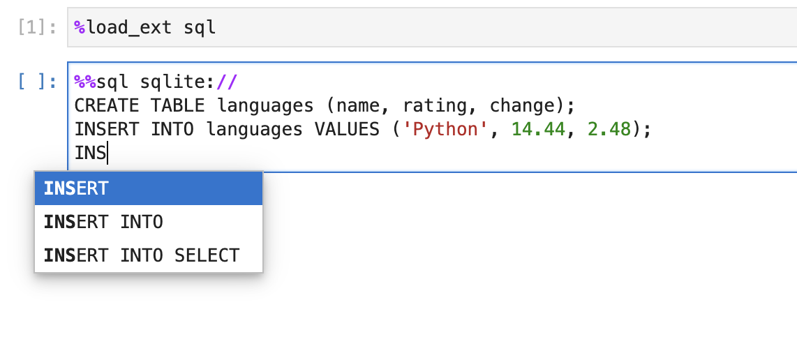

---
jupytext:
  text_representation:
    extension: .md
    format_name: myst
    format_version: 0.13
    jupytext_version: 1.14.5
kernelspec:
  display_name: Python 3 (ipykernel)
  language: python
  name: python3
myst:
  html_meta:
    description lang=en: Enable SQL keywords autocompletion in JupyterLab
    keywords: jupyter, jupyterlab, sql
    property=og:locale: en_US
---

# SQL keywords autocompletion

```{note}
This feature is new and we're looking for feedback, please join our [Slack](https://ploomber.io/community) and share your thoughts!
```

JupySQL supports autocompletion of the most common SQL keywords. You can press
the `tab` key while typing the keyword to view the list of suggestions.

## Installation

```bash
pip install jupysql jupysql-plugin --quiet
```

+++

Now, start Jupyter Lab, and try out the autocomplete feature:




## Known limitations

- It currently autocompletes all cells
- Limited to most common SQL keywords