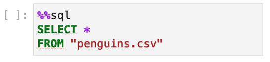

---
jupytext:
  notebook_metadata_filter: myst
  text_representation:
    extension: .md
    format_name: myst
    format_version: 0.13
    jupytext_version: 1.14.5
kernelspec:
  display_name: Python 3 (ipykernel)
  language: python
  name: python3
myst:
  html_meta:
    description lang=en: Enable SQL syntax highlighting in JupyterLab
    keywords: jupyter, jupyterlab, sql
    property=og:locale: en_US
---

# SQL syntax highlighting

+++



You can enable SQL syntax highlighting via [Jupyterlab-lsp](https://github.com/jupyter-lsp/jupyterlab-lsp).

## Installation

Optionally, create a new environment with JupyterLab installed:

```sh
conda create --name jupysqlenv python=3.10 jupyterlab --yes --channel conda-forge
conda activate jupysqlenv
```

JupyterLab-lsp requires Node, if you don't have it, you can install it with conda:

```sh
conda install --channel conda-forge nodejs --yes
```

+++

Now, install the rewuired dependencies using `pip`:

```sh
pip install jupyter-lsp jupyterlab-lsp python-language-server --quiet
```

To run SQL queries on Jupyter, install [JupySQL](https://github.com/ploomber/jupysql):

```bash
pip install jupysql --quiet
```

+++

Finally, add the SQL language server:

```sh
jlpm add --dev sql-language-server
```

Now, start Jupyter Lab, you'll see this in the bottom bar:


After a few seconds, LSP should be fully initialized and you'll get SQL syntax highlighting!


+++

## Querying

Here's some sample code to test it (requires: `pip install duckdb-engine`)

*Note that syntax highlighting won't work on this page, but it'll work on Jupyter.*

```{code-cell} ipython3
%load_ext sql
%sql duckdb://
```

```{code-cell} ipython3
%%sql
INSTALL httpfs
```

```{code-cell} ipython3
%%sql 
SELECT *
FROM "https://raw.githubusercontent.com/mwaskom/seaborn-data/master/penguins.csv"
LIMIT 3
```
