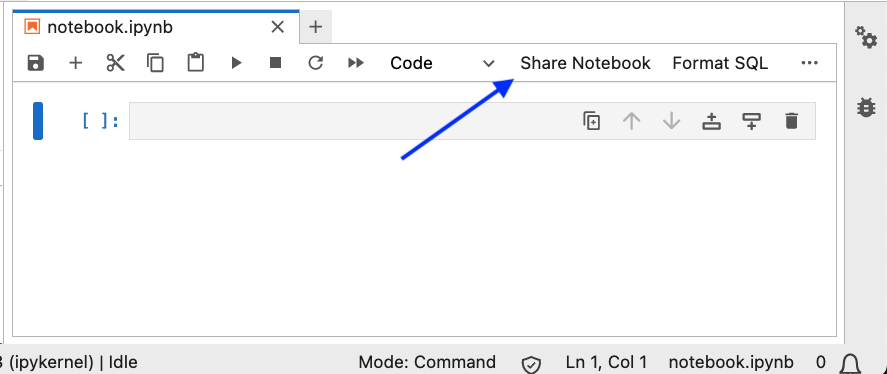

---
jupytext:
  notebook_metadata_filter: myst
  text_representation:
    extension: .md
    format_name: myst
    format_version: 0.13
    jupytext_version: 1.14.5
kernelspec:
  display_name: Python 3 (ipykernel)
  language: python
  name: python3
myst:
  html_meta:
    description lang=en: Share notebooks with the click of a button
    keywords: jupyter, jupyterlab
    property=og:locale: en_US
---

# Sharing notebooks

If you ever wanted to share an analysis with a colleague, you can do so with the click
of a button using our JupyterLab integration. It'll upload your notebook and provide
you with a unique URL that you can share.



## Installation

```sh
pip install jupysql
```

> **For detailed instructions [click here.](https://docs.cloud.ploomber.io/en/latest/dashboards/jupyterlab-plugin.html)**