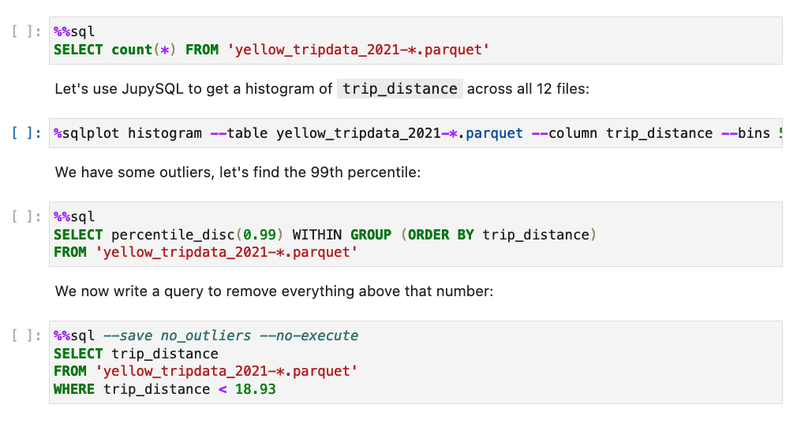

---
jupytext:
  notebook_metadata_filter: myst
  text_representation:
    extension: .md
    format_name: myst
    format_version: 0.13
    jupytext_version: 1.14.5
kernelspec:
  display_name: Python 3 (ipykernel)
  language: python
  name: python3
myst:
  html_meta:
    description lang=en: Enable SQL syntax highlighting in JupyterLab
    keywords: jupyter, jupyterlab, sql
    property=og:locale: en_US
---

# SQL syntax highlighting

+++

To enable syntax highlighting, install `jupysql`:

```sh
pip install jupysql --upgrade
```

Then, open a notebook and *click* on any `%%sql` cell:


